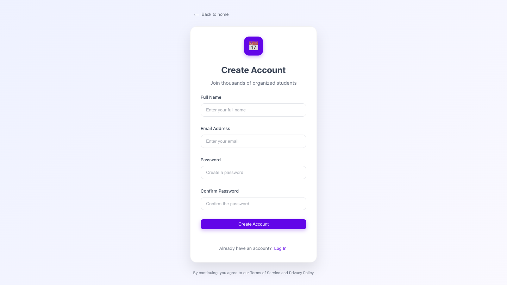
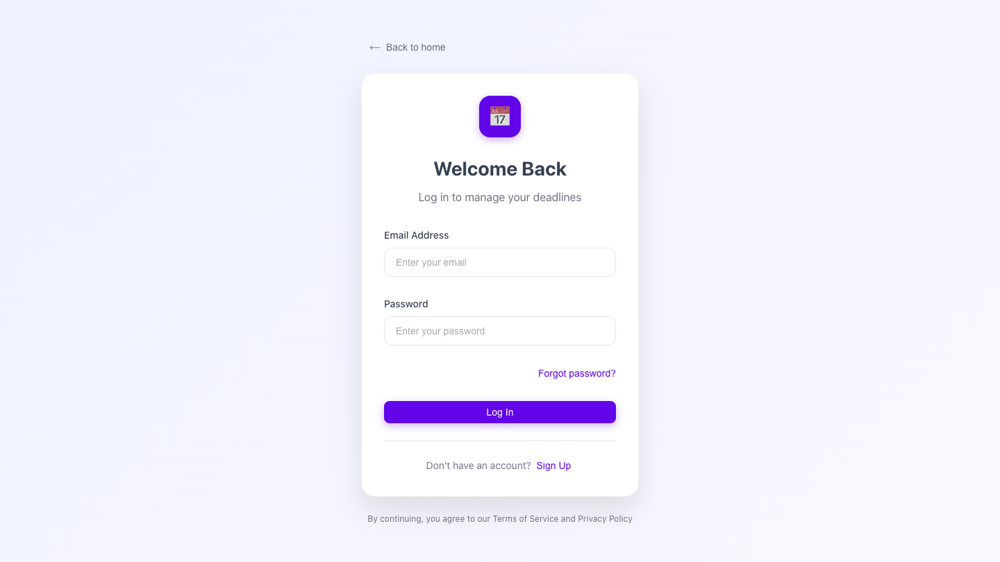
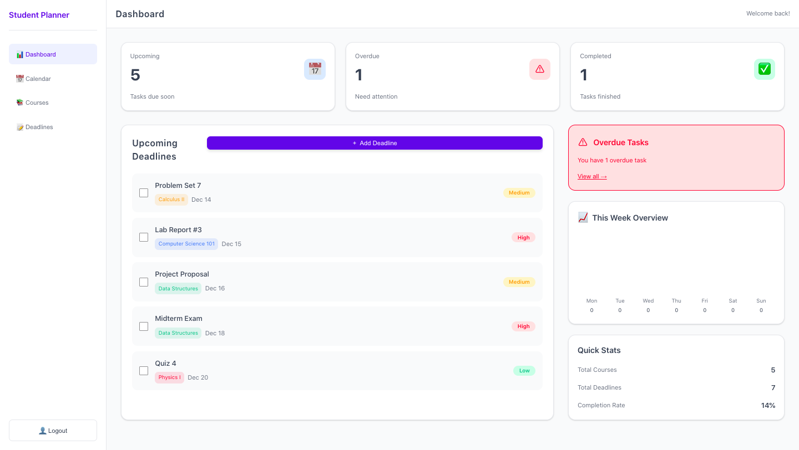
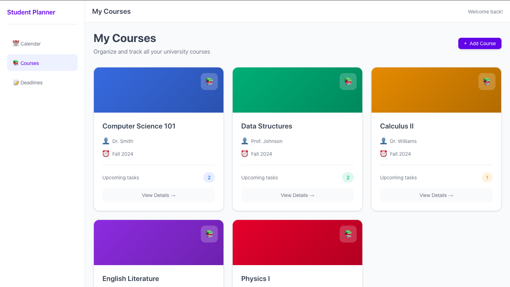
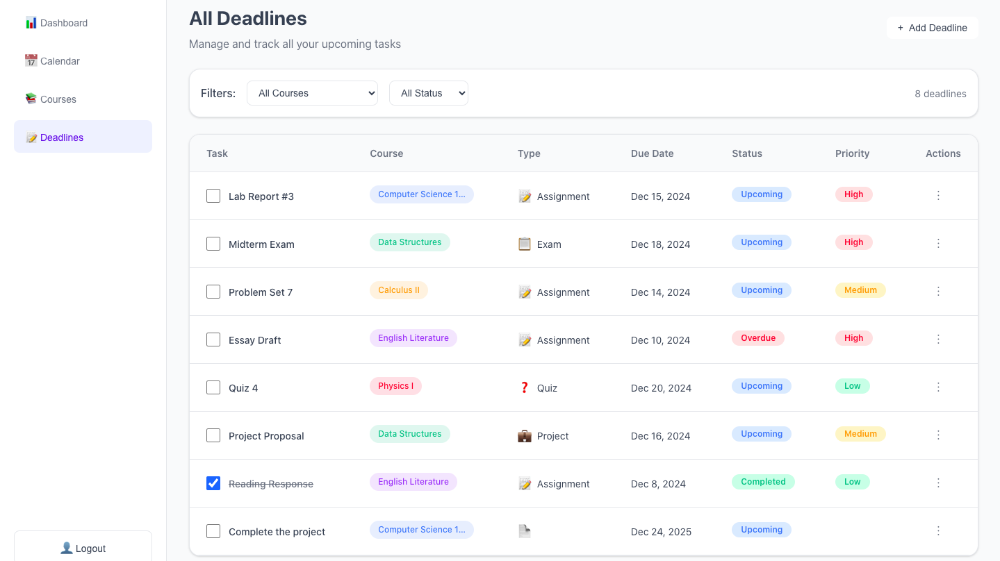

# 🎓 Student Deadline Manager

A clean and modern student-focused web app UI concept for managing academic deadlines and courses.

## 🚀 Features
- Dashboard with upcoming and overdue deadlines
- Full deadline management (add, edit, filter)
- Course organizer with linked tasks
- Monthly calendar view with color-coded events
- Authentication & settings pages

## 🎨 Design
- Minimalistic, student-friendly UI
- Light theme by default
- Rounded components & soft shadows
- Clear visual hierarchy
- Fully responsive layout

## 🧩 Pages
- Landing page
- Auth (Login / Sign Up)
- Dashboard
- Deadlines
- Courses
- Calendar

## 🛠 Tech Stack
- React
- SCSS
- TypeScript

## 📌 Status
UI/UX design project. Backend not implemented

## 🖼 Screenshots
### 🏠 Main page


### 🛠 Create account


### 🔓 Login page


### 🚨 Deadlines dashboard


### 📅 Add deadline


### 📚 Courses page


### 📆 Deadlines page


## 📄 License
Educational & portfolio use

## 💡 How to run

1. Clone the repository:
```bash
git clone https://github.com/MambaXan/Student-Deadline-Manager.git
cd student-deadline-manager
npm start