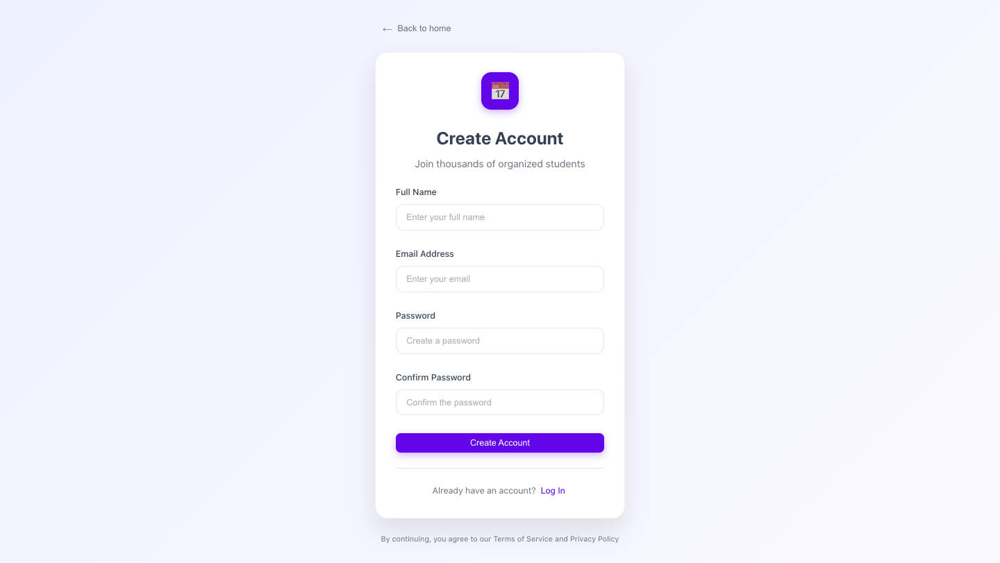
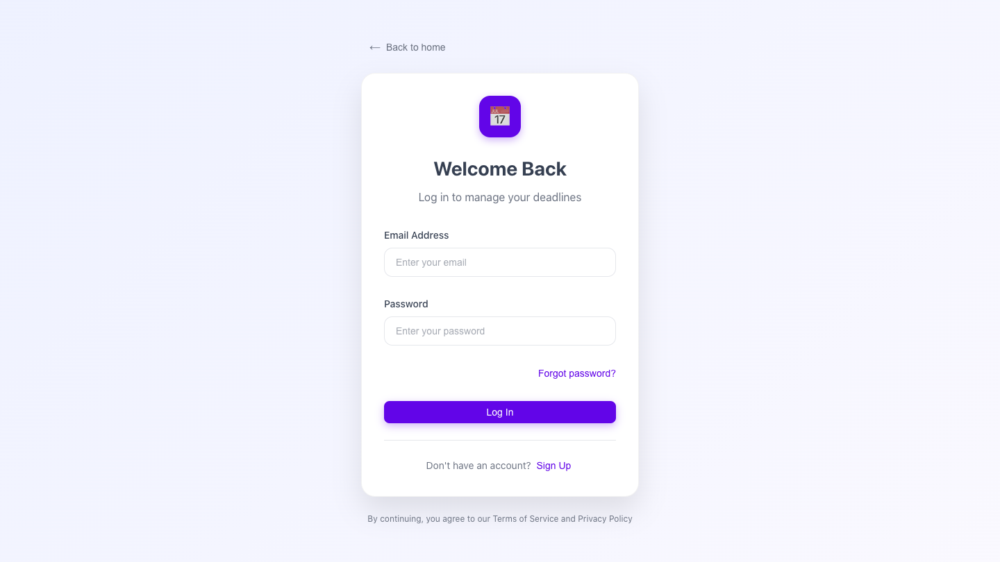
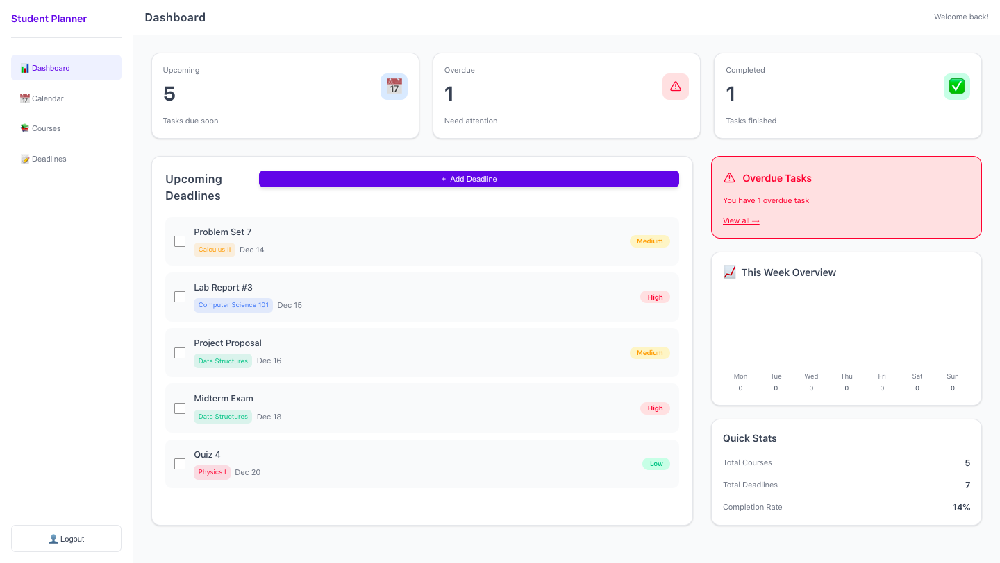
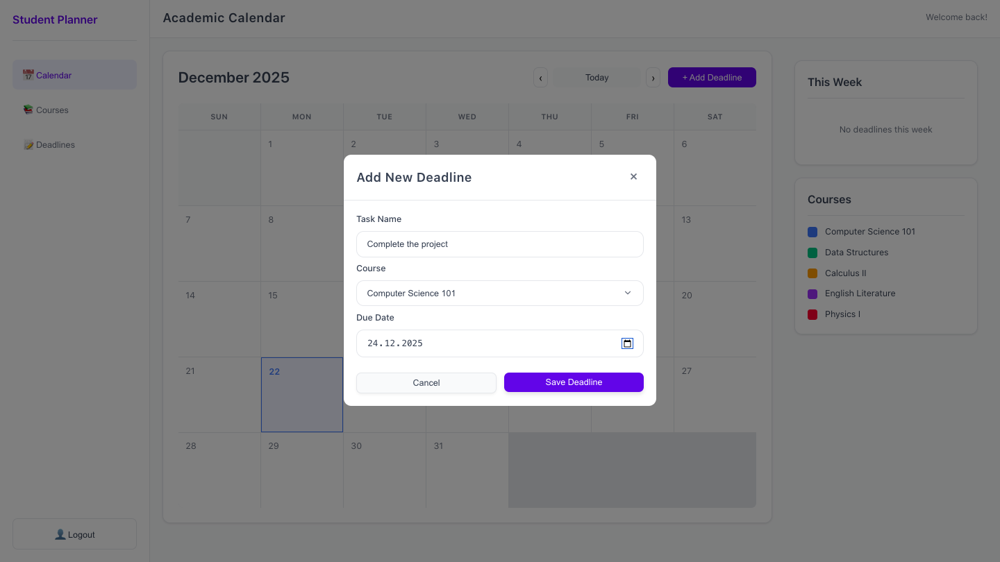
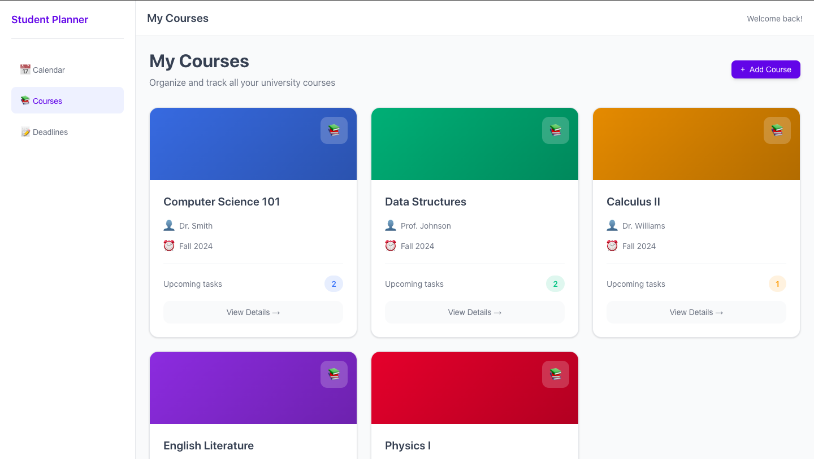
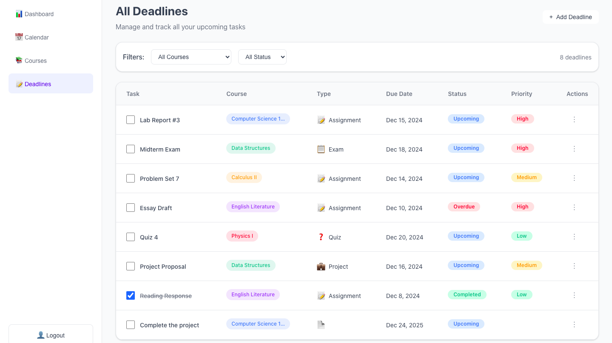

# 🎓 Student Deadline Manager

Student Deadline Manager is a modern web application designed to help students organize their academic life with clarity and efficiency

# ✨ Key features
## 📊 Smart Dashboard
- Upcoming deadlines overview
- Overdue task alert
- Clear visual prioritizing

## 🗂 Deadline Management
- Add, edit and delete deadlines
- Filter tasks by course or status
- Track completion progress

## 📚 Course Organizer
- Link assignments to courses
- Maintain structured academic workflows

## 📅 Calendar View
- Monthly calendar layout
- Color-coded events
- Quick overview of workload distribution

## 🔐 Authentication
- Secure login and registration
- User account management

## ⚡️ Performance-First Design
- Lightweight architecture
- No unnecessary UI libraries
- Optimized rendering

# 🛠 Tech Stack
## Frontend
- React 18
- TypeScript
- SCSS Modules

## Backend
- FastAPI (Python 3.8+)
- SQLAlchemy ORM
- PostgreSQL

## Infrastructure & Deployment
- Supabase - Authentication & Database
- Vercel - Frontend Deployment
- Render - Backend Hosting

# 📂 Project Structure
```text
student-deadline-manager
├── frontend
│   ├── components
│   ├── constants
│   ├── fallback
│   ├── pages
│   ├── styles
│   ├── types
│   └── ui
├── backend
│   ├── auth.py
│   ├── database.py
│   ├── main.py
│   ├── models.py
│   └── schemes.py
├── screenshots
└── README.md
```

## 🖼 Application Review
### 🏠 Main page


### 🛠 Create account


### 🔓 Login page


### 🚨 Deadlines dashboard


### 📅 Add deadline


### 📚 Courses page


### 📆 Deadlines page


## 📄 License
Educational & portfolio use

## ⚙️ Installation

```bash
git clone https://github.com/MambaXan/Student-Deadline-Manager.git
cd student-deadline-manager
npm start

cd frontend
npm install

npm run dev
